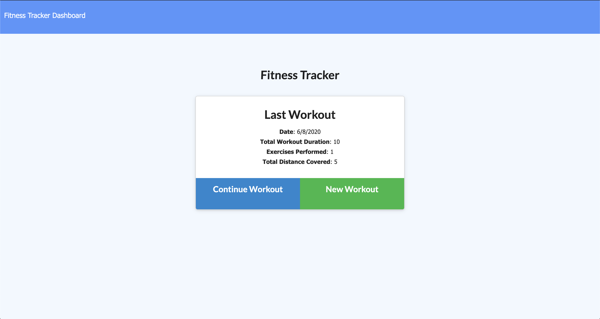

# workout-tracker
 
 ## Description
 The workout-tracker gives the user the ability to track workouts done within a session so that they can keep track of their progress. In order to get this done, the following npm packages were used to make this possible: 
 * Express
 * Mongoose

 ## Installation/Usage
 Please ensure to do the following before running the code:
 * Run `npm install`
 * To run code tpye `npm start`

A deployed version of the app can be found [here](https://workout-tracker-2020-nu.herokuapp.com/?id=5ede7698ec411300175b0bb6)  
Below is a screenshot of the working app  

## License
MIT License

Copyright (c) 2020 Alex Bailon

Permission is hereby granted, free of charge, to any person obtaining a copy of this software and associated documentation files (the "Software"), to deal in the Software without restriction, including without limitation the rights to use, copy, modify, merge, publish, distribute, sublicense, and/or sell copies of the Software, and to permit persons to whom the Software is furnished to do so, subject to the following conditions:

The above copyright notice and this permission notice shall be included in all copies or substantial portions of the Software.

THE SOFTWARE IS PROVIDED "AS IS", WITHOUT WARRANTY OF ANY KIND, EXPRESS OR IMPLIED, INCLUDING BUT NOT LIMITED TO THE WARRANTIES OF MERCHANTABILITY, FITNESS FOR A PARTICULAR PURPOSE AND NONINFRINGEMENT. IN NO EVENT SHALL THE AUTHORS OR COPYRIGHT HOLDERS BE LIABLE FOR ANY CLAIM, DAMAGES OR OTHER LIABILITY, WHETHER IN AN ACTION OF CONTRACT, TORT OR OTHERWISE, ARISING FROM, OUT OF OR IN CONNECTION WITH THE SOFTWARE OR THE USE OR OTHER DEALINGS IN THE SOFTWARE.